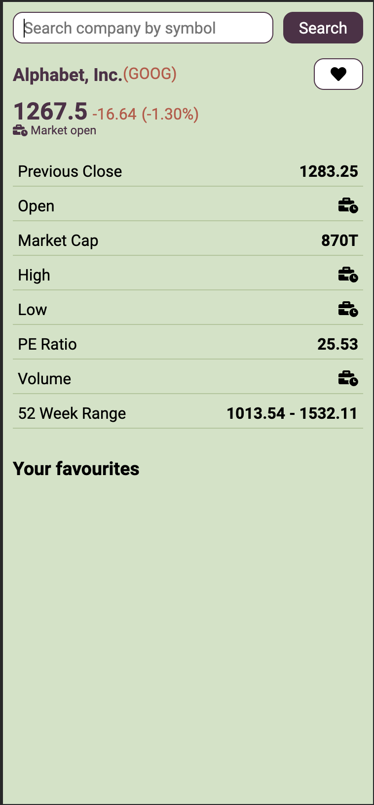

# COMPANY STOCK PRICE
Search for companies so that to see their basic details as well as their current stock price :chart_with_upwards_trend:

  
  
  

## Installation
1. Run `yarn install` so that to install all the dependencies needed
2. Create a `.env` file with `IEX_TOKEN`. You can get the token from [iexcloud](https://iexcloud.io/)
3. Run `yarn start` so that to run the project in development mode
4. If you want to create a production build then run `yarn build`

## Main technologies used in the project
- [react](https://reactjs.org/)
- [redux](https://redux.js.org/)
- [styled-components](https://styled-components.com/)
- [axios](https://github.com/axios/axios)
- [reselect](https://github.com/reduxjs/reselect)
- [typescript](https://www.typescriptlang.org/)
- [webpack](https://webpack.js.org/)
